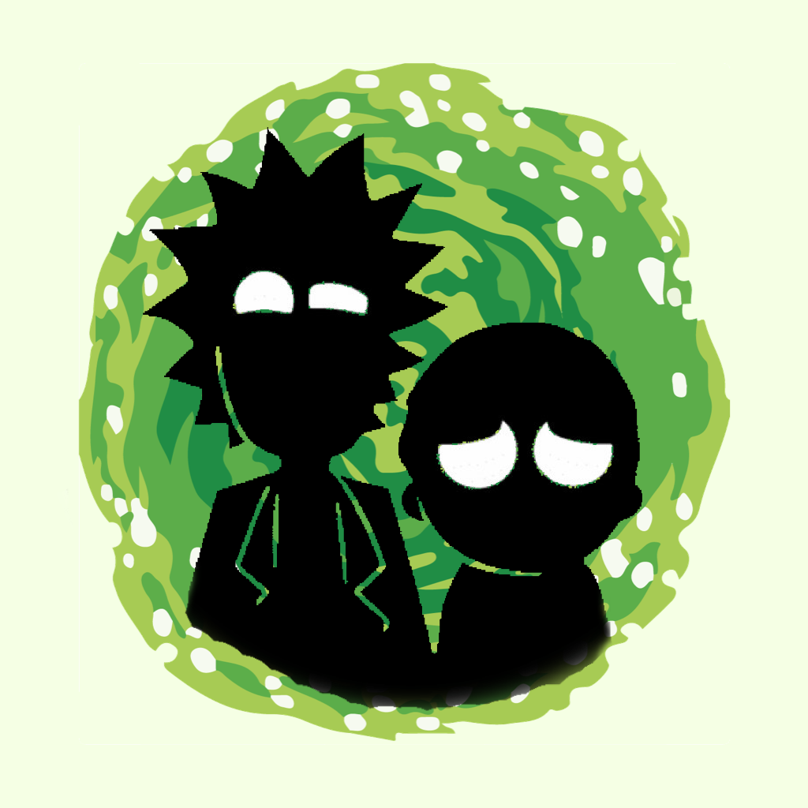

# RickAndMorty
Sample Rick and Morty App built in SwiftUI

### Branches
The "main" branch currently does not use CoreData for the Rick and Morty characters.
As the results are downloaded 20 characters at a time the results tend to jump, which isn't a good user experience.
Plau as the results are not complete, a search facility has not been added.

The feature branch "007_switch_to_coredata" downloads all the records so has search and sort facilities.

The coredata branch has been created to test the switch over to the new <a href="https://developer.apple.com/xcode/swiftdata/" target="_blank">SwiftData</a> framework in iOS17, so shouldn't be considered complete in any way.

    RickAndMortyCharacterWidget
    let character = WidgetCharacter(id: 99, gender: "Unknown", image: URL(string: "https://rickandmortyapi.com/api/character/avatar/799.jpeg")!, location: "Milton Keynes", name: "Bob", origin: "Bognor Regis", species: "Almost human", status: "Barely alive")
